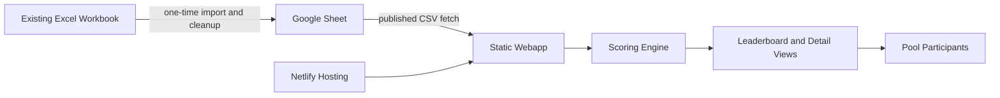

# World Cup Pool Dashboard Design

## Recommended Architecture
Build a static frontend app deployed on Netlify. The app fetches public Google Sheets data at runtime and calculates standings in the browser/app layer. This keeps hosting simple, avoids backend infrastructure, and lets the pool maintainer update standings by editing the Google Sheet instead of redeploying.

## Source Data Model
Use Google Sheet tabs for raw tournament and pool facts:

- `Participants`: participant id/display name.
- `Teams`: team id/name/group.
- `Investments`: participant id, team id, dollars invested.
- `Group Results`: group, advancing teams, eliminated teams.
- `Matches`: round, team A, team B, winner, played status.

The rules from `WC26_PariMutuel_PoolRules.pdf` drive the app scoring logic: team ownership is based on total invested dollars, group advancement starts scoring, group advancers share eliminated team value, and knockout winners carry forward the combined match value.

The existing Excel workbook should be treated as source material for a one-time import. During implementation, inspect the workbook, extract participant/investment/team data, normalize it into the expected Google Sheet tab format, and preserve enough validation notes to catch ambiguous names, duplicate teams, or malformed investments before publishing.

## Core Product Views
Prioritize these first-version views:

- `Leaderboard`: rank, participant, total points, payout position, last-place payout marker, movement if prior standings are available.
- `Participant Detail`: teams owned, dollars invested, ownership percentage, points by team and round.
- `Team Detail`: total investment, owners, current carried value, scoring history.
- `Rules Summary`: plain-English explanation of how scoring works.
- `Data Freshness`: visible last-updated timestamp and optional data validation warnings.

## Scoring Responsibilities
The app should calculate standings from raw spreadsheet data rather than relying on spreadsheet formulas. This makes the public behavior easier to test and audit. The spreadsheet remains the editable source of truth; the app owns deterministic scoring.

Key scoring modules:

- Parse and validate spreadsheet rows.
- Calculate team total investment and participant ownership percentages.
- Apply group-stage advancement scoring.
- Apply knockout match scoring and carry-forward team values.
- Aggregate participant totals and rankings.

## Deployment Approach
Use Netlify by default:

- Connect the Git repository to Netlify.
- Configure the frontend build command and publish directory.
- Store the Google Sheet published CSV base URL or sheet id in a Netlify environment variable if needed.
- Deploy automatically on pushes to the main branch.
- Use Netlify's managed HTTPS and optional custom domain support.

If spreadsheet access needs secrets later, add a small serverless function or build-time import step. For the first version, a public published Google Sheet keeps the system much simpler.

## Alternatives Considered
- `AWS S3 + CloudFront`: reliable and inexpensive, but more setup than needed for this project.
- `AWS Amplify Hosting`: AWS-native Git-connected deploys, but still more AWS-specific moving parts than Netlify.
- `Vercel`: equally viable for static hosting, but Netlify is a simple fit for this read-only dashboard.
- `Admin UI + database`: more polished long-term, but unnecessary for a 20-25 person public pool dashboard.

## Spreadsheet Import Workflow
When the Excel workbook is available, map it into the Google Sheet schema the app expects:

- Extract participant names and normalize participant ids.
- Extract team investments and validate dollar amounts are whole-dollar values.
- Calculate team total investment from imported rows as a cross-check, but keep the app as the authority for scoring.
- Produce Google Sheet-ready tabs for `Participants`, `Teams`, and `Investments`.
- Leave `Group Results` and `Matches` ready for manual tournament updates once the World Cup starts.
